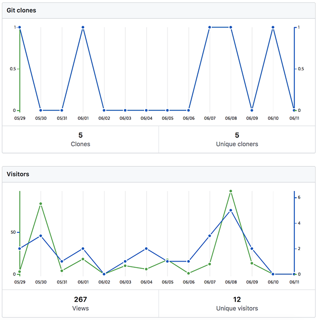
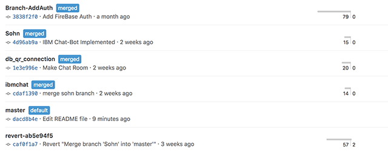
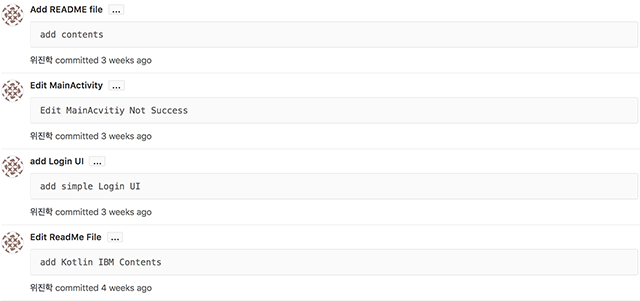
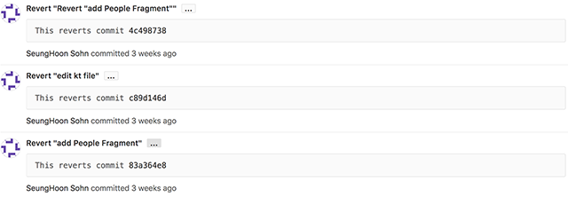
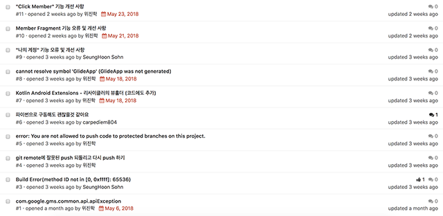
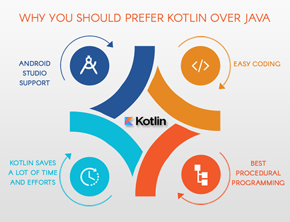
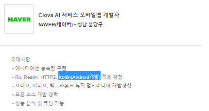
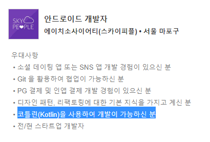

# MY_PT_MANAGER
---

## 🔍프로젝트소개

1. 트레이너라면 회원들과의 대화를 통해 지속적인 회원 관리를 가능하게 합니다.
2. 회원이라면 운동을 하면서 궁금점. 자세,식단,방법등을 질문하며 관리합니다.

## 목표

1. Kotlin을 사용하여 Android App 개발하며 Java와의 장단점을 비교,정리합니다.
2. FireBase DataBase 의 장점인 실시간 환경을 사용합니다.
3. openSource Zxing library 활용합니다.
4. Watson Conversation 서비스를 활용하여 질의응답이 불가능한 시간에도 답변이 가능하게 합니다.

### 추가 구현 예정
* Google Play Store에 등록합니다.
* 이후 github에 private repository로 옮겨 계속 진행해볼까 합니다.
* 안드로이드 앱 디자인이나 ChatBot에 대해 관심이 있어서 함께 해보실 분 연락바랍니다.

## Developers

* 위진학

> FireBase Google Login

> Zxing Java to Kotlin

> Edit IBM Watson Intents 

> Add Simple Android Layout

> Edit README File

* 손승훈

> Edit FireBase User Account Info

> Zxing Library Java to Kotlin

> Add IBM Watson Connect

> Edit README File

## 사용 오픈소스 링크

[zxing-android-embedded][2]

[chatbot-watson-android][3]

## SW개발을 위해 노력한 사항.

[android_Kotlin_QRCode_Zxing][4]
#### 1. zxing library에서 QRcode Read & Write 부분을 Kotlin 코드로 변환하여 github에 공유


#### 2. 기능별로 Branch를 나누어 기능이 정상적으로 동작되면 Master Branch에 병합


#### 3. Commit 규칙을 정하여 Remote Repository에 간결한 commit message 작성.



#### 4. Issue 사항을 기록하여 반복되는 Issue를 줄임.



## commit 규칙

* 제목과 본문을 빈 행으로 분리한다
* 제목 행을 50자로 제한한다
* 제목 행 끝에 마침표를 넣지 않는다
* 제목 행에 명령문을 사용한다
* 본문을 72자 단위로 개행한다
* 어떻게 보다는 무엇과 왜를 설명한다

## License

Licensed under the [Apache License 2.0][1]

	Copyright (C) 2012-2018 ZXing authors, Journey Mobile

	Licensed under the Apache License, Version 2.0 (the "License");
	you may not use this file except in compliance with the License.
	You may obtain a copy of the License at

	    http://www.apache.org/licenses/LICENSE-2.0

	Unless required by applicable law or agreed to in writing, software
	distributed under the License is distributed on an "AS IS" BASIS,
	WITHOUT WARRANTIES OR CONDITIONS OF ANY KIND, either express or implied.
	See the License for the specific language governing permissions and
	limitations under the License.
Licensed under the [Apache License 2.0][1]

	Copyright 2010-2018 JetBrains s.r.o.
 
    Licensed under the Apache License, Version 2.0 (the "License");
    you may not use this file except in compliance with the License.
    You may obtain a copy of the License at
 
    http://www.apache.org/licenses/LICENSE-2.0
 
    Unless required by applicable law or agreed to in writing, software
    distributed under the License is distributed on an "AS IS" BASIS,
    WITHOUT WARRANTIES OR CONDITIONS OF ANY KIND, either express or implied.
    See the License for the specific language governing permissions and
    limitations under the License.
    
Licensed under the [Apache License 2.0][1]

    Copyright 2017 IBM Corp.
    
    Licensed under the Apache License, Version 2.0 (the "License");
    you may not use this file except in compliance with the License.
    You may obtain a copy of the License at
    
        http://www.apache.org/licenses/LICENSE-2.0
    
    Unless required by applicable law or agreed to in writing, software
    distributed under the License is distributed on an "AS IS" BASIS,
    WITHOUT WARRANTIES OR CONDITIONS OF ANY KIND, either express or implied.
    See the License for the specific language governing permissions and
    limitations under the License


-----------


# Kotlin 전망
 * IntelliJ IDEA의 개발사 JetBrains에서 2011년에 공개한 프로그래밍 언어.

##### Kotlin VS Java


 


###### 1) 인텔리제이(Android Studio)가 지원함.

   * Android Studio 3.0에 기본으로 포함되고 같은 회사에서 만들었기에 자연스럽게 빌드와 디버깅을 할 수 있어
   
     불편함이나 부담이 없다. 더불어 Java에서 Kotlin으로의 코드 변환도 제공한다.

###### 2) 쉬운 코딩.

   * 코틀린은 자바보다 코드가 간결하여 Java의 boilerplate 코드들을 줄여주고 간결한 코드를 작성할 수 있는 문법을 제공한다.
   
     때문에 Java보다 유지보수를 더 편하게 할 수 있다. 더불어 Koltin과 달리 Java는 매번 새로운 버전이 출시될 때마다
   
     이전 버전에 포함된 기능을 지원해야 하기에 이는 결국 코드를 증가시키고, 계층 간 아키텍처의 부재를 초래한다는 단점이 존재한다.

###### 3) 시간과 노력의 절감.

   * 자바에 비해 코드를 적게 사용하기 떄문에 개발자들은 코드를 작성하고 버그를 수정하는 데 몇 시간을 투자할 필요가 없다.
   
     전체 코딩 과정에서 소요되는 시간이 줄어들기 때문에 이는 개발자들에게 큰 강점이다.

###### 4) 최고의 절차적 프로그래밍.

   * 코틀린은 절차적 프로그래밍과 기능적 프로그래밍을 결합하여 최상의 결과를 가져오는 것을 목표로 한다.

##### * Kotlin의 향후 전망


 * Realm 사의 2017년 4분기 보고서에 따르면 코틀린의 채택률은 
 
    미국, 캐나다, 인도, 일본 등 많은 국가에서 증가하는 추세로 안드로이드 개발에 새로운 바람을 불어넣고 있다.


 * 더불어 구글의 2017 I/O 이후 코틀린의 성장세는 꾸준히 증가하고 있으며
 
    2018년 12월 중순에 이르러 자바와 같은 비율을 차지할 것으로 예상된다.

##### * 취업 시장에서의 위상

##### 네이버


##### 카카오


##### 스타트업



* 위 자료에서와 같이 Mobile Application 개발자를 뽑는 대부분의 기업들이 Kotlin 개발 역량을 갖춘 지원자를 우대하는 추세이다. 

    따라서 Kotlin 개발 역량 함양은 App 개발 분야로 커리어를 쌓고자 하는 개발자에게 좋은 자산이 될 것으로 사료된다. 

    더 나아가 앞서 살펴본 Realm사의 분석과 Google의 최근 동향을 고려한다면 Kotlin의 습득은 개인 역량 강화를 넘어 

    변화해가는 개발 트렌드에 한 발 앞서 적응해가는 습관을 들이는 첫 걸음이 될 수 있을 것이다.     

---
# Android에서 Kotlin 시작하기

## 1. Kotlin Start

##### 인텔리제이로 코틀린하기

   * 인텔리제이 버전 두가지, Ultimate(유료),Communitiy(무료)
   * Download https://www.jetbrains.com/idea/download
   * Setting > Plugins > Install IntelliJ plugins 이동 후 > 코틀린 검색

##### 코틀린 활성화 Gradle Project

   * Create new Project > Gradle 선택 > 오른쪽 화면 Kotlin(java) 클릭
   * Group Id 와 Artifact Id 입력
   * Use auto-import flag 와 Create directories for empty ~ 체크하기
   * Module name에 chapter01을 입력한 다음 Finish

## 2. Kotlin Basic

##### val 이랑 var 의 차이점

   * var는 변경 가능한 변수를 선언하는 키워드 —> 변경가능할 수 있고 값을 다시 지정가능
   * val는  읽기 전용 변수 —> 나중에 변경할 수 없으므로 생성할때 반드시 초기화 필요.
   표현식으로 흐름제어
   * 표현식은 값을 평가하는 구문, 구문은 결과 값을 반환하지 않는다.
   * 자바에서 if ~ else, try ~ catch 같은 흐름 제어 블록은 구문. (변수에 결과값을 대입하기 위해 블록 밖에서 변수를 초기화 해야된다.)
   * 코틀린에서는 흐름 제어 블록은 표현식(결과를 값에 직접 대입 가능, 함수로부터 반환 가능, 인자로 전달 가능.)
   
##### 널 문법
   * 코틀린은 널 값을 지정할 수 있는 변수는 ?와 함께 선언.
   * 타입확인, 형변환도 있다.  타입확인을 위한 연산자 is
   
##### Smart cast
   * 사용자를 대신해 타입을 확인하고 기억하고 암시적으로 참조를 구체적인 타입으로 형변환
   * var 필드와 로컬 변수는 smart cast에 사용될 수 없다.
   * 왼쪽에서 타입을 검사하는 경우 지연 연산되는 연산자의 오른쪽에서 동작하기도 한다.
    
##### 명시적 형변환
   * 참조를 타입으로 형변환하는데 이를 명시적으로 하기 위해 as 연산자 사용.
   * 널 값이 가능한 값으로 형변환하기 위해서는, 그저 필요한 타입을 널 값이 가능한 타입으로 선언 하기만 하면된다.
   
##### when
   * switch 문의 일반적인 사용법과 비슷한다.
   * 하나도 빠뜨리면 안되기 때문에 마지막 분기에서 else가 되도록 강제한다.
   * when도 표현식으로 사용 가능하다. 결과값은 반환하는 결과 값이 된다.
   * 분기 코드가 같은 경우에는 상수를 함께 묶는 것도 가능하다 . 0,1 -> true
   * when은 범위 연산자를 지원한다. In 연산자를 이용해 값이 범위 안에 포함 되어 있는지 확인 한다.
   * when에서도 smart cast 형변환이 사용가능하다.
   * 인자가 없는 when은 if~else 절을 대체하게 된다.
   
##### 함수반환
   * 표현식을 return 키워드와 함께 사용한다.
   * 클로저로 부터 값을 반환해야 한다면, 반환할 때 레이블로 단서를 달아야 한다.
   
##### 타입 체계
   * 코틀린에서 최상위 타입은 Any 라고 부른다.
   * unit은 void와 유사하다. 유닛은 싱글톤 인스턴스와 함께 적절한 타입으로 나타낸다.
   * 값을 지니지 않는 Nothing이 추가되었다. 컴파일러에 함수가 정상적으로 끝나지 않는다는 사실을 알리는데 사용된다.
   
##### 기본타입
   * 코틀린에서는 모든 것이 객체.
   * 자동으로 숫자를 확장하지 않기 때문에 반드시 명시적으로 변환해줘야 한다.
   * 타입 간에 변환을 위한 함수 전체 집합으로는 toByte(),toShort(),toInt(),toLong(),toFloat(),toDouble(),toChar() 이 있다.
   * 비트연산자가 있다 자바와 달리 내장 연산자가 아니라 이름이 있는 함수이며, 여전히 연산자처럼 사용이 가능하다. 
   * shl (2의 지수승으로 곱하기 ), shr(2의 지수승으로 나누기 ), ushr (배타적 논리합)
   * 문자  : char는 단일 문자를 나타내며, ‘A’ 와 같이 단일 따옴표로 표기. (자바에서 처럼 숫자로 다뤄지지 않음.)
   * 문자열: 자바와 마찬가지로 불변, 이중 따옴표나 삼중 따옴표를 사용해 표기
   * 배열  : 라이브러리 함수인 arrayOf()를 사용하여 배열 생성한다.  박싱 타입을 피하고자 이를 대체 할 수 있는 배열 클래스 제공
   *  		(박싱 타입을 피하고자 이를 대체 할 수 있는 클래스 제공 boxing -> primitive 타입을 Wrapper)
   * 주석  : 자바와 동일
   * 임포트 시킬때 다른 패키지에서 같은 이름을 사용한다면 패키지 이름에 별칭을 줄 수 있다. com.pakage.Foo as Foo
   
##### 늦은 초기화
   * 늦은 초기화는 Class과 생성된 동시에 변수가 초기화되면 재접근이 용이하다는 장점이 있지만 굳이 이 변수를 사용하지 않는 경우에는 메모리 손해가 발생한다는 단점이 존재할 때 사용한다.
   JAVA에서는 늦은 초기화시 null에 대한 접근이 가능하고 명시할 수 있지만 Kotlin은 필요한 경우에 명시해야 한다는 차이점이 있다.
   
   * Kotlin에서는 다음과 같은 두가지의 늦은 초기화 방법을 제공한다.
         
   1] lateinit
   ```kotlin     
        public class MyTest {
         lateinit var subject: TestSubject

         @SetUp fun setup() {
         subject = TestSubject()
            }

         @Test fun test() {
         subject.method()  // dereference directly
            }
        }
        
     // JAVA와 달리 Nullable이 아닌 변수로 초기화가 가능해짐.
   ```

##### lateinit 사용 조건      
  
   * var(mutable)에서만 사용이 가능하다  
   * var이기 때문에 언제든 초기화를 변경할 수 있다.   
   * null을 통한 초기화를 할 수 없다.
   * 초기화를 하기 전에는 변수에 접근할 수 없다.
      - lateinit property subject has not been initialized
   * 변수에 대한 setter/getter properties 정의가 불가능하다. 
   * lateinit은 모든 변수가 가능한 건 아니고, primitive type에서는 활용이 불가능하다(Int, Double 등)
    
    
##### lateinit 초기화 확인
 ```kotlin
         if (foo::bar.isInitialized) {
         println(foo.bar)
            }
            
         // 위 예시와 같이 .isInitialized를 사용하여 lateinit 초기화를 확인 후 안전하게 접근할 수 있다.
         // 다만 이 기능은 Kotlin 1.2 버전부터만 사용이 가능하다.
 ```


##### lazy
   ```kotlin
        val sampleAdapter: SampleAdapter by lazy {
         SampleAdapter(ImageLoaderAdapterViewModel(this, 3))
             }
        
         // 필요한 경우 언제든 초기화가 가능한 lateinit과 달리 생성 후 값을 변경할 수 없는 val에 사용된다.
   ```
   
             
##### lazy 사용 조건
  
   * 호출 시점에 by lazy 정의에 의해서 초기화를 진행한다.
   * val(immutable)에서만 사용이 가능하다.
   * val이므로 값을 교체하는 건 불가능하다.
   * 초기화를 위해서는 함수명이라도 한번 적어줘야 한다.
   * lazy을 사용하는 경우 기본 Synchronized로 동작한다.
    
##### 표현식으로서의 흐름제어 자바 vs 코틀린

   * 자바에서는 if...else try...catch -> 흐름제어 블록은 구문
   ```java
   public boolean isZero(int x){
    boolean isZero;
    if(x == 0)
        isZero = true;
    else
        isZero = false;
    return true;
   }
   ```
   
   * kotlin에서는 if...else try...catch -> 흐름제어 블록은 표현식
   
   ```kotlin
   fun isZero(x: Int): Boolean{
    return if(x == 0) true else false
   }
   
   val success = try{
   readFile()
   true
   }catch (e : IOException){
   false
   }
   ```
   * 값이 변경 가능한 변수의 사용을 피하게 해준다.
   * if 문 밖에서 변수를 선언하고 각 분기 내부에서 초기화하는 일반적인 사용 방법을 피할 수 있다
 
## 3. Kotlin OOP

##### Class

* 각기 다른 타입의 변수와 메소드를 다 같이 그룹화 하는 방법으로 사용자만의 타입을 만들 수 있게 해준다.
* 자바와 달리 코틀린에서는 같은 소스파일 안에 여러 개의 클래스를 정의 할 수 있다.
* 새로운 인스턴스를 생성하기 위해 new 키워드를 사용할 필요가 없다.(컴파일 에러 발생)
* 생성자에 직접 접근하는 것을 원치 않을 때는 생성자를 private나 protected 또는 internal로 표시해야된다.

##### Kotlin에서 Interface 동시에 여러개 구현하기 

```kotlin
interface Drivable{
    fun drive()
}
interface Sailable{
    fun saill()
}
class AmphibiousCar(val name: String) : Drivable, Sailable{
    override fun drive() {
    }
    override fun saill() {
    }
}
```

##### 가시성 제어자
* public 어디서든지 접근 .
* internal 모듈 코드에서만 접근.
* protected 이를 정의한 클래스와 파생된 클래스에서만 접근
* private 이를 정의한 클래스 스코프 내에서만 접근.

```kotlin
//부모의 클래스에서 해당 필드를 open으로 명시했으면
//파생된 클래스는 가시성 레벨을 변경할 수 있다.
open class Container{
    protected open val fieldA: String ="Some value"
}
class DerivedContainer: Container(){
    public override val fieldA: String ="Something else"
}
```

##### 추상클래스
* 추상클래스는 인스턴스를 생성할 수 없다.(파생된 클래스가 공유하는 공통의 메소드 집합을 제공하기 위해)

```kotlin
//인터페이스와 달리 함수의 몸체 정의부를 제공하지 않는 경우에는
//해당함수를 추상함수로 표시해야됨
abstract class Q{
    abstract  fun somthing()
}
//임의의 정수를 반환하는 someMethod를 정의한 부모 클래스를 갖으며
//DDerived클래스는 이 클래스를 상속 메소드를 abstract로 표시
//그러면 AlwaysOne 클래스는 항상 정수를 반환하는 메소드를 위한 함수 몸체를 제공 해야됨
open class AParent protected constructor(){
    open fun someMethod(): Int = Random().nextInt()
}
abstract class DDerived : AParent(){
    abstract override fun someMethod(): Int
}
class AlwaysOne: DDerived(){
    override fun someMethod(): Int {
        return 1
    }
}
```

## 4. Kotlin Function

##### 고차함수(Higher-order function)

* 고차 함수는 그저 다른 함수를 매개변수로 받고나, 반환 값으로 함수를 반환하거나, 둘다를 행하는 함수다. 함수의 재사용성을 극대화 시키는 것.
* 함수를 인자로 전달 받거나 함수를 반환하는 함수.
* 함수가 일급 시민으로 취급되어야 한다. -> 함수 타입을 일반적인 타입과 동일하게 사용할 수 있어야한다.

##### 함수할당
* 함수 할당은 여러 번 사용하는 자명하지 않은 함수나 시간이 많이 소요되는 함수를 설정해야 하는 경우에 유용하다.

##### 클로저
* 바깥 스코프에 정의된 변수와 매개변수에 접근할 수 있는 함수.
* 클로저는 지역 변수에도 접근할 수 있다.
* 클로저는 클로저가 감싼 변수를 변경할 수도 있다.

##### 익명함수
* 리터럴을 사용할 때는 반환 값을 명시할 수 없다.
* 명시적으로 반환 타입을 명시하고 싶을 수도 있다.
* 소위 익명 함수라 불리는 함수를 사용할 수 있다.

## 5. Kotlin에서 OpenSource 사용하기

##### Android에서 QR Code Zxing Library 사용법

* app level에서 build.gradle에 추가

```groovy
 //zxing
 implementation 'com.journeyapps:zxing-android-embedded:3.6.0'  
```

> Qr Code Read

* manifests

```groovy
 <uses-permission android:name="android.permission.CAMERA"/>
```

* Activity listener Event

```groovy
IntentIntegrator(this).initiateScan() // `this` is the current Activity
```

* Return result Method

```kotlin
    // QR Code Get the results
    override fun onActivityResult(requestCode: Int, resultCode: Int, data: Intent) {
        val result = IntentIntegrator.parseActivityResult(requestCode, resultCode, data)
        if (result != null) {
            if (result.contents == null) {
                Toast.makeText(this, "Cancelled", Toast.LENGTH_LONG).show()
            } else {
                Toast.makeText(this, "Scanned: " + result.contents, Toast.LENGTH_LONG).show()
            }
        } else {
            super.onActivityResult(requestCode, resultCode, data)
        }
    }
```

> Qr Code Write

* Qr Code Write Code

```kotlin
   val multiFormatWriter = MultiFormatWriter()
   val bitMatrix: BitMatrix = multiFormatWriter.encode("UserInputText", BarcodeFormat.QR_CODE, 200, 200)
   val barcodeEncoder = BarcodeEncoder()
   val bitmap: Bitmap = barcodeEncoder.createBitmap(bitMatrix)

   imageView.setImageBitmap(bitmap)
```

# IBM Watson Service

1. Watson Service Start

2. Watson Service Conversation


[1]: http://www.apache.org/licenses/LICENSE-2.0
[2]: https://github.com/journeyapps/zxing-android-embedded
[3]: https://github.com/IBM-Cloud/chatbot-watson-android
[4]: https://github.com/weejinhak/Android_Kotlin_QRCode_Zxing    
